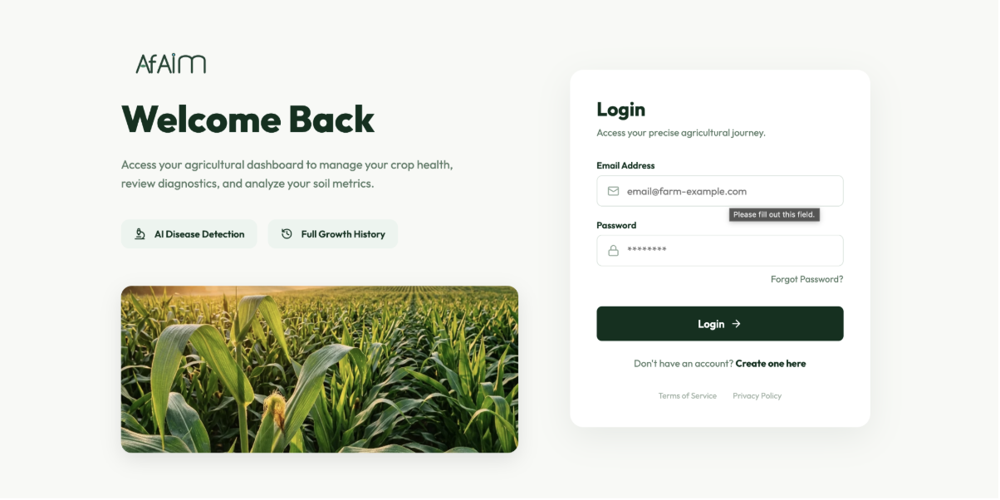
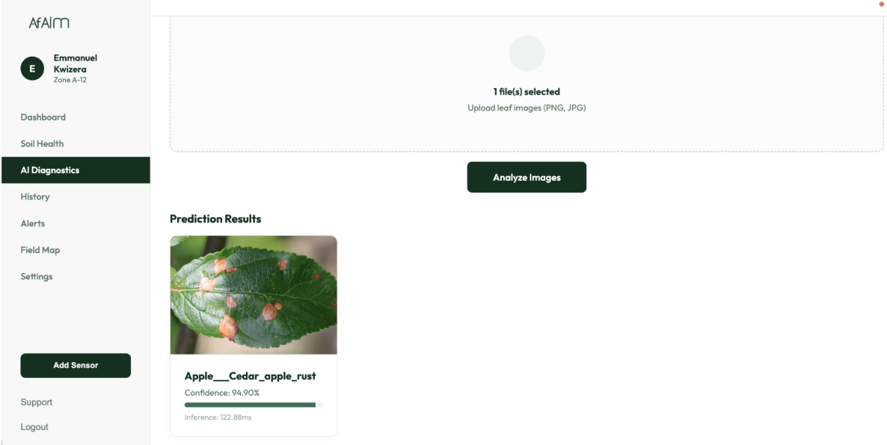
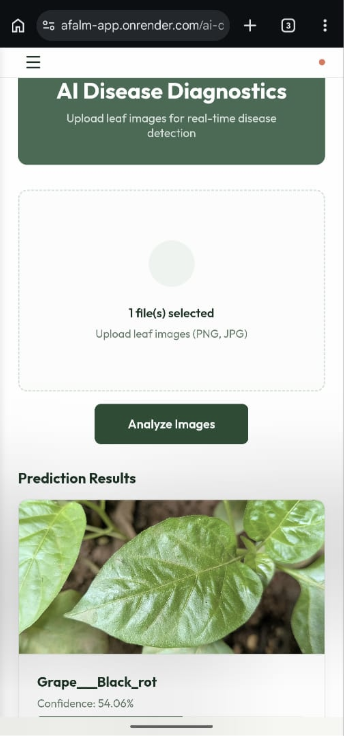

# AFALM: System Testing & Validation Results

This document outlines the testing procedures, metrics, and visual results for the Agricultural Farming AI & Logging Machine (AFALM) platform.

## 1. User Authentication & Security

**Objective**: Verify that the Node.js API Gateway correctly handles user login, authenticates credentials, and issues valid JWTs for secure access.

### 1.1 Secure Login Flow
- **Procedure**: User enters credentials on the login screen.
- **Expected Outcome**: API returns a secure JWT, and the React frontend redirects the user to the protected dashboard.
- **Result**: **PASS**. The UI successfully validates inputs, blocks empty fields, and securely logs the user in.

*(Screenshot: Secure Login Interface)*

---

## 2. Machine Learning Validation (Disease Prediction)

**Objective**: Verify that the Computer Vision model (TFLite) returns accurate predictions with valid confidence scores and that the UI handles both desktop and mobile views perfectly.

### 2.1 Desktop Disease Diagnosis Test
- **Test Image**: Leaf exhibiting symptoms of Cedar Apple Rust.
- **Expected Outcome**: Detection of *Cedar_apple_rust* with high confidence.
- **Result**: **PASS**. The FastAPI inference engine successfully processed the tensor and returned 'Apple___Cedar_apple_rust' with a **94.90% confidence score**. The UI rendered the result perfectly in under 123ms.

*(Screenshot: Desktop Disease Prediction)*

### 2.2 Mobile Disease Diagnosis Test
- **Test Image**: Leaf exhibiting symptoms of Black Rot.
- **Expected Outcome**: Detection of *Black_rot* with corresponding confidence, rendering correctly on a mobile viewport.
- **Result**: **PASS**. The React application successfully collapsed into mobile view, uploaded the image, and returned 'Grape___Black_rot' with 54.06% confidence.

*(Screenshot: Mobile AI Diagnostics)*

---

## 3. Platform Analytics & Admin Overview

**Objective**: Verify that the Node.js backend successfully queries MongoDB to aggregate platform-wide statistics for the Admin Dashboard.

### 3.1 Aggregated Analytics Test
- **Procedure**: Load the authenticated Admin Dashboard to view platform health and historical scans.
- **Expected Outcome**: Display total disease scans, total soil analyses, ML model uptime, and a feed of recent global predictions.
- **Result**: **PASS**. The dashboard correctly aggregated 9 total disease scans and 5 soil analyses, proving the backend successfully queried the separate MongoDB collections. The UI also correctly rendered the historical prediction cards.

